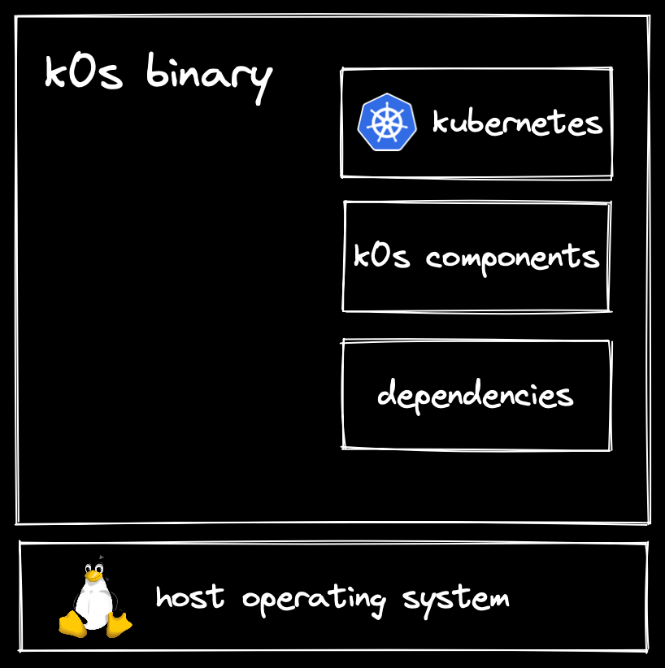

#### Running Kubernetes in 

#### IoT/Edge environments
with

You can follow along here:
https://trawler.github.io/kcd-berlin-2022/

### The Challenges of IoT Devices

- Wide range of devices  <!-- .element id="fragment-list" -->
- Computation and resource constraints <!-- .element id="fragment-list" class="fragment fade-in" -->
- Security is a core concern <!-- .element id="fragment-list" class="fragment fade-in" -->
Note: 
- Wide Range: IoT devices can comprise of multiple architectures and operating systems. Sometime there will be multiple types of devices in the same cluster.
- Security: It is necessary to keep the IoT edge devices away from unauthorized access. Discovery, authentication, and trust establishment in IoT edge and anonymity and traceability of devices are challenging in high-scale environments. An additional security layer is necessary to ensure that different IoT applications execute isolated from each other in the device.

#### Distributed as a single binary
<table>
  <tr>
    <td>
        <ul style=text-align:left;font-size:5vh;line-height:1.6;list-style-type:square>
            <li>Can be installed on any Linux without additional SW packages*</li>
            <li>Security vulnerabilities can be fixed directly in k0s</li>
            <li>OS and k0s upgrades are independent from each other</li>
            <li>Easy installation process</li>
        </ul>
    </td>
    <td></td> 
 </tr>
</table>

#### Batteries Included, but swappable
<table>
<tbody>
  <tr>
    <td style=border:none;>By default, k0s includes:</td>
    <td rowspan=2 style=vertical-align:middle;border:none;></td>
  </tr>
  <tr>
    <td style=border:none;>
        <ul style=text-align:left;font-size:5vh;line-height:1.6;list-style-type:square>
            <li>Containerd as runtime</li>
            <li>Kube-Router and Calico for networking</li>
            <li>Etcd and Kine/SQLite for datastore</li>
        </ul>
    </td>
  </tr>
</tbody>
</table>
